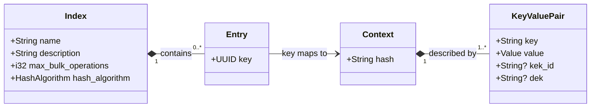

Udex
=====

> **Status**: Early development — not yet production ready. APIs and data models are subject to change.

> **Disclaimer**: Udex is provided as-is, without warranty of any kind. The author makes no guarantees regarding fitness for purpose, security, correctness, or availability. Use at your own risk.

## Overview

Udex is a universal index that maps arbitrary unique keys against contexts. It is lightweight, fast, and efficient for high transaction volumes across organisational and regulatory boundaries.  entity identifiers across boundaries.

It has been built with the following integration and data management scenarios in mind:

1. Providing stable and per-party keys for resolution across integration boundaries so that no parties share the same keys for the same entities (preventing compromise of one party leading to compromise of another) and that no external party needs to know the internal keys of the entity so that the internals are decoupled from the interfaces.
2. Replacing a sensitive primary key with an non-sensitive one - e.g. use a UUID rather than a Credit Card number (PAN, which is PCI-DSS restricted) as keys to interact with Credit Card accounts.
3. Attaching arbitrary metadata to an entity when the native store doesn't support it - for example data classification and leasing information.

It is not intended to be a generic entity database and aggregate queries are deliberately not supported.

For full detail on the data model, operations, components, security model, and design principles, see [docs/ARCHITECTURE.md](docs/ARCHITECTURE.md).

For common questions, see the [FAQs](docs/FAQ.md).

> This project also gives me a chance to learn rust, develop AI coding processes and tools and play with a few other technologies.

## Documentation

| Document | Description |
|---|---|
| [docs/ARCHITECTURE.md](docs/ARCHITECTURE.md) | Data model, operations, security model, and design principles |
| [docs/FAQ.md](docs/FAQ.md) | Design rationale and common questions |
| [CONTRIBUTING.md](CONTRIBUTING.md) | Getting started, development guidelines, and testing standards |
| [projects/rust/CONTRIBUTING.md](projects/rust/CONTRIBUTING.md) | Rust-specific coding standards and conventions |
| [SECURITY.md](SECURITY.md) | Vulnerability reporting policy |
| [.devcontainer/](.devcontainer/README.md) | VS Code dev container — tools and first-time setup |
| [projects/compose/](projects/compose/README.md) | Docker Compose — local PostgreSQL + Hydra services |
| [projects/protobuf/](projects/protobuf/README.md) | Protobuf API definitions — source of truth for all API types |
| [projects/rust/api/](projects/rust/api/README.md) | `udex-api` — generated types, authz, hashing |
| [projects/rust/server/](projects/rust/server/README.md) | `udex-server` — gRPC server |
| [projects/rust/datastore/](projects/rust/datastore/README.md) | `udex-datastore` — PostgreSQL implementation |
| [projects/rust/sdk/](projects/rust/sdk/README.md) | `udex-sdk` — Rust client SDK |
| [projects/rust/cli/](projects/rust/cli/README.md) | `udex-cli` — command-line interface |

## Core Concepts

There are four core domain concepts:

- **Index** — a named, configured namespace for entries. Indices are independent: the same context can appear in multiple indices with different keys. Index names are lowercase strings and are immutable once set.
- **Context** — a set of key-value pairs that uniquely identifies an entity. Udex hashes the pairs to produce a stable **context fingerprint**. Contexts are immutable — they cannot be updated, only deleted and recreated.
- **Key** — a server-generated UUIDv4 assigned to a context within an index. Keys are globally unique across all indices and permanent for the lifetime of the entry.
- **Entry** — the binding of a key to a context within an index. The 1:1 invariant ensures that one context fingerprint maps to exactly one key within any given index (see [The 1:1 Entry–Context Model](#the-11-entrycontext-model) below).

`Value` is a union of `String`, `i64`, `f64`, and `bool`. `kek_id` and `dek` are optional envelope-encryption fields — when present they signal that the value is ciphertext and carry the wrapped key metadata. Both are opaque to the server and excluded from the context hash.

### The 1:1 Entry–Context Model

A **context** is a set of key-value pairs that uniquely describes an entity at a point in time. Udex hashes the pairs to produce a **context fingerprint**. The core invariant is:

> **One context fingerprint maps to exactly one entry key — always.**

See [the FAQ](docs/FAQ.md#why-are-keyscontexts-11) for the reasoning behind this.

`create_entry` is idempotent: submitting the same context twice returns the same key both times. No duplicates accumulate. For the rationale behind this design and how to handle key migrations, see [the FAQ](docs/FAQ.md#why-are-contexts-immutable).

### Access

The API is three gRPC services (defined in [`projects/protobuf/`](projects/protobuf/)):

| Service | Operations |
|---|---|
| `IndexService` | Create, describe, update, list, delete indices |
| `EntryService` | Create, delete, lookup by key, lookup by context, bulk read/write |
| `HealthzService` | Server liveness check |

All requests require a JWT (ES256) issued via **OAuth2 Client Credentials** flow. Permissions are scoped per index per operation — a token for one index cannot access another. The [Rust SDK](projects/rust/sdk/) and [`udex` CLI](projects/rust/cli/) are the primary clients.

### Client Usage
There are a number of client roles:
* Key Holder - uses keys to access data.
* Context Holder - has the context, but doesn't want to hand out its own keys.
* Indexer - performs indexing operations between Key Holders and Context Holders.
* Admin - maintains indices.

Combinations of the first three roles are possible: A single logical client could play both Key Holder and Context Holder roles, though generally not for the same index, and also act as an Indexer, or a client could be both the Context Holder and Indexer etc.

The Key Holder must obviously retain the key, however the Indexer has a choice - it can resolve the hash from the context (as long as it knows which hash function to apply - and it should always use the SDK for this to ensure hash stability) or it can retain the hash for re-use.

Admin is expected to be CI/CD or Operational role and generally would not be a Key Holder or Context Holder.

As an example of this see [Open Banking Consumer Data Right (CDR)](./docs/use_cases/AU_Open_Banking_CDR.md) use case - more specifically the [Resource Data Retrieval with Id Permanence data flow](./docs/use_cases/AU_Open_Banking_CDR.md#4a-phase-3-resource-data-retrieval-with-id-permanence-implemented-with-udex). 

## Tech Stack

| Concern | Technology |
|---|---|
| API spec | [Protobuf v3](https://protobuf.dev) — server, client, data models, and SDKs generated from `.proto` definitions via [prost](https://docs.rs/prost) / [tonic-build](https://docs.rs/tonic-build) |
| Transport | [tonic](https://docs.rs/tonic) — gRPC over HTTP/2 with TLS |
| Async runtime | [tokio](https://docs.rs/tokio) |
| TLS | [rustls](https://docs.rs/rustls) with [aws-lc-rs](https://docs.rs/aws-lc-rs) crypto backend — used for gRPC transport, datastore connections, and HTTP clients |
| Datastore | [PostgreSQL 16+](https://www.postgresql.org) accessed via [sqlx](https://docs.rs/sqlx) (compile-time verified queries, async, connection pooling) |
| Hashing | [xxhash-rust](https://docs.rs/xxhash-rust) (XXH3) — fast non-cryptographic hash used to fingerprint contexts |
| Serialization | [serde](https://docs.rs/serde) / [serde_json](https://docs.rs/serde_json) / [serde_yaml](https://docs.rs/serde_yaml) — derived on all API types; drives JSON and YAML output in the CLI |
| Authorization | OAuth2 Client Credentials flow — JWT (ES256) validated on every request via [jsonwebtoken](https://docs.rs/jsonwebtoken); permissions are scoped per index per operation |
| Logging | [tracing](https://docs.rs/tracing) + [tracing-subscriber](https://docs.rs/tracing-subscriber) (structured JSON in production, human-readable in development) |
| CLI | [clap](https://docs.rs/clap) — `udex` binary for server lifecycle, index/entry management, JWT inspection, and context hashing |
| Error handling | [thiserror](https://docs.rs/thiserror) (library errors) + [anyhow](https://docs.rs/anyhow) (application errors) |

For the roadmap of deferred features, see the [FAQ](docs/FAQ.md#what-future-features-might-udex-support).

## License

MIT — see [LICENSE](LICENSE).

## Installation
> Placeholder will be filled in prior to release

### Deployment
> Placeholder will be filled in prior to release

## Development / Contributing

See [CONTRIBUTING.md](CONTRIBUTING.md) to get started. All key documents are indexed in the [Documentation](#documentation) section above.

## Info

This project is developed using [Claude Code](https://claude.ai/code) (Anthropic) with [Intent v2.8.0](https://github.com/matthewsinclair/intent) for steel thread and work package management. Plugins: [`rust-analyzer-lsp`](https://github.com/anthropics/claude-code-plugins). Skills: [`in-essentials`](https://github.com/matthewsinclair/intent).