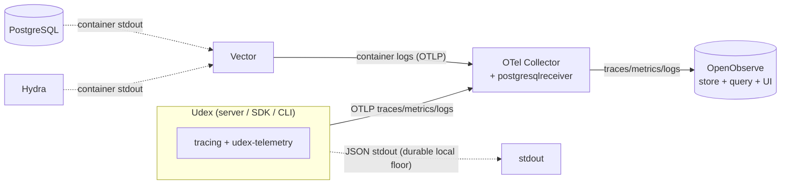

# Udex Architecture Intent
> **Prerequisites**: Read [Core Concepts](../README.md#core-concepts) in the README before this document. The architecture assumes familiarity with Index, Context, Key, Entry, and the 1:1 invariant.

> See [Design Decisions](DESIGN_DECISIONS.md) for the rationale behind key decisions, and the [FAQs](FAQ.md) for common questions.

## Overview

Udex is a universal lookup directory for entities designed to be lightweight, fast, and efficient for high transaction volumes, including across organisational and regulatory boundaries. The design is motivated by complex distributed integration scenarios where internal entity representations — including primary keys — must not be exposed across integration boundaries, preventing tight coupling and limiting exposure to [Hyrum's Law](https://www.hyrumslaw.com/).

This document describes the system components, deployment model, operations, security model, and design principles.

## Components

* **API definitions** ([`projects/protobuf/`](../projects/protobuf/README.md)): Protobuf v3 service and message definitions — the source of truth for all API types. Server, SDK, and CLI code is generated from these files.
* **Server** ([`udex-server`](../projects/rust/server/README.md)): a stateless gRPC application component that provides the API and business logic for Udex. Designed to be horizontally scaled. Consumes a YAML configuration file at startup.
* **Datastore** ([`udex-datastore`](../projects/rust/datastore/README.md)): holds the Udex index state. Transactions, distribution, and scaling are handled by the datastore implementation and are opaque to the application. Currently implemented on PostgreSQL 16+.
* **SDK** ([`udex-sdk`](../projects/rust/sdk/README.md)): a Rust client SDK for building systems that interact with Udex. Handles token acquisition and all RPC calls.
* **CLI** ([`udex-cli`](../projects/rust/cli/README.md)): the `udex` binary for server lifecycle management, index and entry operations, JWT inspection, and context hashing. Also serves as the reference client for integration testing.
* **Configuration**: a YAML file consumed at startup that specifies the datastore connection, TLS material, auth server endpoints, and the initial index set. Configuration is static — it is not mutated at runtime.

### Development Components

These components are used during development and testing but are not part of a production deployment.

* **Docker Compose Environment** ([`projects/compose/`](../projects/compose/README.md)): runs PostgreSQL and Ory Hydra locally. Used for integration tests and end-to-end development. Started with `docker compose` using the env file generated by `scripts/gen-env.sh`.
* **Observability Fixture** (part of [`projects/compose/`](../projects/compose/README.md#observability)): an always-on, OpenObserve-backed OpenTelemetry pipeline (OTel Collector + OpenObserve + Vector) that receives the telemetry the server, SDK, and CLI emit. See [Observability](#observability) below. Not part of a production deployment — Udex emits standard OTLP and can target any OTel-compatible backend.
* **Ory Hydra** ([hydra](https://www.ory.sh/hydra/)): an OAuth2/OIDC server used in the local dev environment to issue JWTs for integration testing. Not part of the Udex application — any standards-compliant OAuth2 authorization server can be used in production.
* **Dev Container** ([`.devcontainer/`](../.devcontainer/README.md)): a VS Code dev container that provides a fully configured development environment with all prerequisites pre-installed (Rust toolchain, protoc, Docker CLI, Trivy). First-time setup runs automatically on container creation.

## Deployment
> Details will be updated before release

The only deployable artefact is the CLI - this is used to start the server and perform administrative tasks. The Server will take care of initialising the DB given the correct access and configuration.

The SDK will be published as a crate before release.

## Operations

> For a service-level overview of the API, see [API](../README.md#api) in the README. This section specifies operation semantics.

Udex has two types of operations: Index Usage and Index Management.

### Index Usage Operations

Index usage operations, including bulk operations, are transactional. The full API is defined in [`udex.entry.v1.proto`](../projects/protobuf/udex.entry.v1.proto).

* **Create** an entry for a context, returning a unique key. Idempotent — if the context already exists in the index, the existing key is returned unchanged; no duplicate is created.
* **Delete** an entry by key. Removes the key-to-context binding.
* **Lookup** a context by its unique key. Returns an error if the key does not exist.
* **Reverse Lookup** a key by context hash. Returns the key if one exists, or an empty result if the context is not present in the index. Because the 1:1 invariant holds, at most one key is returned.

All operations can be performed in bulk up to a configurable limit per index. Bulk writes are transactional — if any operation fails, all are rolled back. Create and Lookup are the most commonly used operations and are the most optimised.

### Index Management Operations

Admin operations are exposed as the `IndexService` gRPC API (defined in [`udex.index.v1.proto`](../projects/protobuf/udex.index.v1.proto)). Initial indices can also be declared in the server configuration file, which applies them on startup.

* Create a new index
* Describe an index (name, configuration, metadata)
* Update an index's mutable fields (description, limits)
* Delete an index — only permitted when the index has no entries
* List all indices

## Usage

See [Client Usage](../README.md#client-usage) in the README for client roles, role combinations, and sequence diagrams illustrating typical usage patterns.

## What Udex Is Not

Udex is not an entity store, a graph database, or a general-purpose query engine. It holds the minimum context required to resolve entities across boundaries, not the entities themselves. Clients must know the key or context they are looking for; search is not supported. It is not intended to be used directly by humans apart from specific admin operations. For the design rationale, see [Design Decisions](DESIGN_DECISIONS.md#what-wont-udex-support).

## Security Model

### Authentication & Authorization

Udex initially only supports [OAuth 2.0 Client Credentials Flow](https://oauth.net/2/grant-types/client-credentials/). Supporting Authorization Code flow would require Udex to know about Authorization Servers and code exchanges, which conflicts with the simplicity principle.

Tokens are Json Web Tokens (JWTs) with the standard set of claims plus additional ones that map to the permissions model. Udex validates the token for every operation and will fail bulk transactions if any operation cannot be validated.

The `grpc.health.v1.Health` service is the only unauthenticated endpoint. It exposes status for three registered services: `""` (overall server), `"udex.entry.v1.EntryService"`, and `"udex.index.v1.IndexService"`. See [Design Decisions](DESIGN_DECISIONS.md#why-does-udex-use-the-grpc-health-checking-protocol-instead-of-a-custom-healthz-endpoint) for the rationale behind the standard protocol choice.

### Permissions

Udex does not support field-level permissions (e.g. on context keys or values). Where fine-grained permissions are required they must be provided by systems between the client and Udex.

#### Index Level

There is a permission per index per operation and each must be specifically enabled. There is also a permission for the maximum number of bulk operations per index. When performing bulk operations the lowest of the index's bulk limit and the client's permission limit applies.

#### Admin Level

Admin operations (index management) are exposed via `IndexService` and follow the same JWT permission model as entry operations — each operation requires a specific scope. See [`docs/SECRETS.md`](SECRETS.md) for the credential and scope inventory.

### Encryption

#### In Transit

The Udex server defaults to only exposing APIs via TLS 1.3 and clients are required to support this. Opting out of TLS requires explicit configuration by an administrator. Server–Datastore communication is also via TLS. Datastores that do not support TLS are not supported.

#### At Rest

Udex does not support encryption at rest directly, though supported datastores and/or their storage components are expected to. Udex supports encryption of context values by clients via envelope encryption: context key/value pairs can have the relevant metadata attached (i.e. the encrypted Data Encryption Key and the id of the Key Encryption Key). This metadata is not included in the context hash. Changing the encryption requires creation of a new context (as contexts are immutable).

> **Example**: Payment card numbers (PANs) are required by [PCI DSS](https://www.pcisecuritystandards.org/standards/pci-dss/) to be stored unreadably. An envelope-encrypted context value can hold the PAN, with a Udex key used externally to reference the card.

#### Secrets

Udex configuration only supports secrets by injection (e.g. environment variables) and will not support secrets directly in configuration files. The application component will only hold secrets in memory. Udex supports rolling out new secrets. See [`docs/SECRETS.md`](SECRETS.md) for the full inventory of credentials and key material used in the project.

## Observability

Udex is instrumented with [OpenTelemetry](https://opentelemetry.io/) for distributed tracing, metrics, and log aggregation. The application is coupled only to the open OTel standard (OTLP) — never to a specific backend — so it can be pointed at any OTLP-compatible system. A local OpenObserve-backed fixture (part of the base [`projects/compose`](../projects/compose/README.md#observability) stack) is provided for development. For *why* it is OpenObserve-backed and modular (rather than the original Grafana stack, ClickHouse, or the ClickStack all-in-one), see [Design Decisions › Observability](DESIGN_DECISIONS.md#observability).

### Open-standard boundary

All OpenTelemetry provider/exporter setup is confined to one crate, `udex-telemetry`. Binaries (server, CLI) call `udex_telemetry::init` to build the OTLP exporters, sampler, and resource attributes from configuration; the rest of the workspace depends only on the `tracing` API. The SDK is deliberately **provider-free**: as a client library it never installs a global provider — it uses only the vendor-neutral `opentelemetry` API to emit client spans and inject a W3C `traceparent`, composing into a host application's own OTel setup.

### Signals

* **Traces** — every gRPC request is a span (named by method) with child spans for datastore queries (`db.*`). An inbound W3C `traceparent` is continued, so a trace spans client → server → datastore.
* **Metrics** — per-method request counters and latency histograms (pushed via OTLP), plus PostgreSQL server metrics scraped by the Collector's [`postgresqlreceiver`](https://github.com/open-telemetry/opentelemetry-collector-contrib/blob/main/receiver/postgresqlreceiver/README.md).
* **Logs (hybrid)** — the server emits logs over OTLP when an endpoint is configured, and *always* also writes JSON to stdout. That stdout floor is the durable fallback: it survives a Collector outage because nothing has to be shipped for it to exist. Separately, Vector ships postgres/hydra container stdout **through** the Collector so it lands alongside application logs — convenient for correlation, but it shares the Collector's fate rather than surviving it (ST0028 changed this; under ST0027 Vector wrote to the store directly).

### Topology

Vector tails only the `postgres` and `hydra` containers — the application's own stdout is never ingested by it, and is a local floor rather than a shipped one. Routing Vector through the Collector leaves the Collector as the only part of the *pipeline* that names a backend.

### Configuration

Observability is configured via the optional `observability` section of the server configuration (and the CLI's, which threads through to it). It is **disabled by default**; when enabled it specifies the OTLP endpoint, an optional CA to trust (for `https://` endpoints), optional headers for header-authed backends, per-signal toggles, the head trace-sampling ratio, and extra resource attributes. The local dev/CI fixture's collector is **plaintext and keyless** (`http://…:4317`); for a real deployment point the app at a TLS-terminating, possibly header-authed backend (see [`projects/rust/telemetry/README.md`](../projects/rust/telemetry/README.md)). See `udex_telemetry::TelemetryConfig`.

### Deployment

The fixture is **part of the base `projects/compose` stack** — it comes up with PostgreSQL and Hydra, always-on (in the devcontainer and in CI), with nothing extra to start. OpenObserve is the unified store *and* the UI, at <http://localhost:5080>; the collector ingests OTLP and also scrapes PostgreSQL metrics. Starting the backends imposes no overhead on the application, which only emits OTLP when configured. The k3d dev deployment runs with observability **enabled** and full sampling, exporting to the compose collector via `host.k3d.internal` (the same host bridge used for PostgreSQL and Hydra). For component details and usage, see [projects/compose/README.md#observability](../projects/compose/README.md#observability).

## Test Strategy

Udex follows the **Test Diamond** — integration tests carry the bulk of the coverage, with unit tests used only where isolation genuinely reduces debugging time.

### Suite Hierarchy

| Suite | Prefix(es) | What it covers | Authority |
|---|---|---|---|
| SDK integration tests | `test_sdk_`, `test_sdk_oauth2_` | Full stack via TLS + OAuth2 + gRPC wire format — the closest thing to a real client | **Primary** — if the SDK tests pass, the system works end-to-end |
| k8s / multi-instance tests | `test_sdk_k8s_`, `test_sdk_k8s_multi_` | SDK suite against a live k3d cluster; the `_multi_` variants pin requests to individual pods (via `kubectl port-forward`) to verify cross-instance statelessness with the default 2 replicas | Supplementary — deployment & multi-instance coverage |
| Server integration tests | `test_server_`, `test_server_oauth2_` | Full gRPC stack with auth; used when debugging issues that are hard to isolate via SDK | Supplementary |
| Index service tests | `test_index_service_` | gRPC handler input-validation paths that cannot be triggered by the SDK (SDK always sends valid inputs) | Supplementary — validation contract only |
| Entry service tests | `test_entry_service_` | Same as above plus a minimal isolation set for debugging the entry handler without the full SDK stack | Supplementary — isolation debugging |
| Datastore tests | `test_datastore_` | SQL queries, transactions, and migrations tested directly against PostgreSQL | Supplementary |
| CLI tests | `test_cli_`, `test_cli_oauth2_` | CLI command integration, including OAuth2 token flows | Supplementary |
| Observability tests | `obs` (non-k8s), `test_obs_k8s_` | Assert telemetry lands in OpenObserve. The always-run `obs` binary stands up a local OTLP-exporting server on every `cargo test`, and also covers the container log floor and the collector's PostgreSQL receiver; the `test_obs_k8s_` tests assert the k3d deployment's telemetry lands (gated on `K8S_SERVER_URL`). OpenObserve is a hard dependency — these fail, never skip | Supplementary — telemetry coverage |

### Rationale

The SDK tests exercise TLS termination, JWT validation, gRPC wire format, and the full handler chain in one shot, which is the path a real client takes. Service-layer tests (index/entry service) are kept small because their scenarios are either already covered by the SDK suite or only add value for handler-level input validation — paths that the SDK can never trigger because it always sends well-formed, correctly-hashed inputs.

The server is statelessness and is designed to be horizontally scaled (see e.g. [projects/k8s](../projects/k8s/README.md)).

### Test Naming Convention

Every integration test function **must** be prefixed with one of the canonical layer indicators listed in the table above. This makes it immediately obvious which layer a failing test covers and enables filtering with `cargo test test_sdk_`.

### Shared Fixtures

Common fixture helpers (`bind_file_secret`, `hydra_public_url`, `hydra_admin_url`, `register_hydra_client`) live in `udex-test-utils` — a dev-only workspace crate (`publish = false`). Check there before writing fixture code in a test file. See [`intent/llm/MODULES.md`](../intent/llm/MODULES.md) for the full module registry.

## Principles

* **Simplicity** — Udex should do one thing well rather than multiple things in a mediocre way.
* **Reliability** — Udex should be highly reliable, including in the event of node failures.
* **Performance** — Udex should handle many transactions concurrently. Ideally it will support 100–1000s of transactions per second with the right configuration and infrastructure.
* **Easy to develop and test** — Udex should be able to run locally for end-to-end testing. Project structure, usage and tooling should follow conventions and standards.
* **Easy to operate** — Udex should be simple to set up with sensible defaults and no more configuration than necessary. Udex should work well with standard tooling (HTTP, Kubernetes, \*Nix).
* **Minimise shell scripting** — prefer application code or established CLI tooling over shell scripts.
