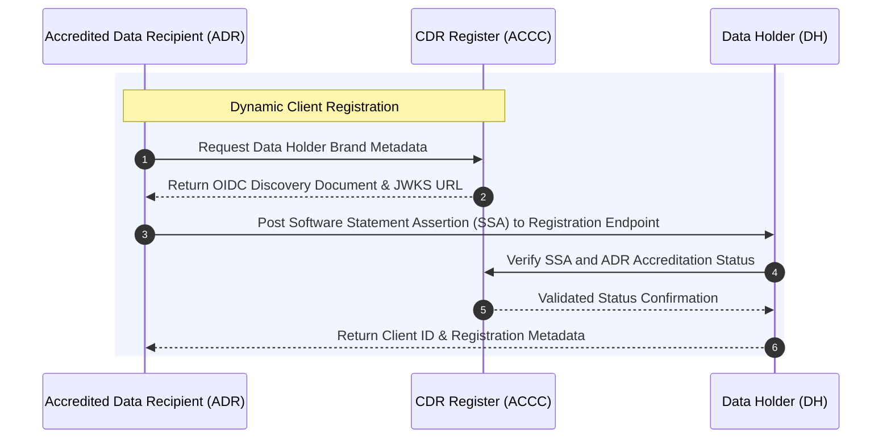
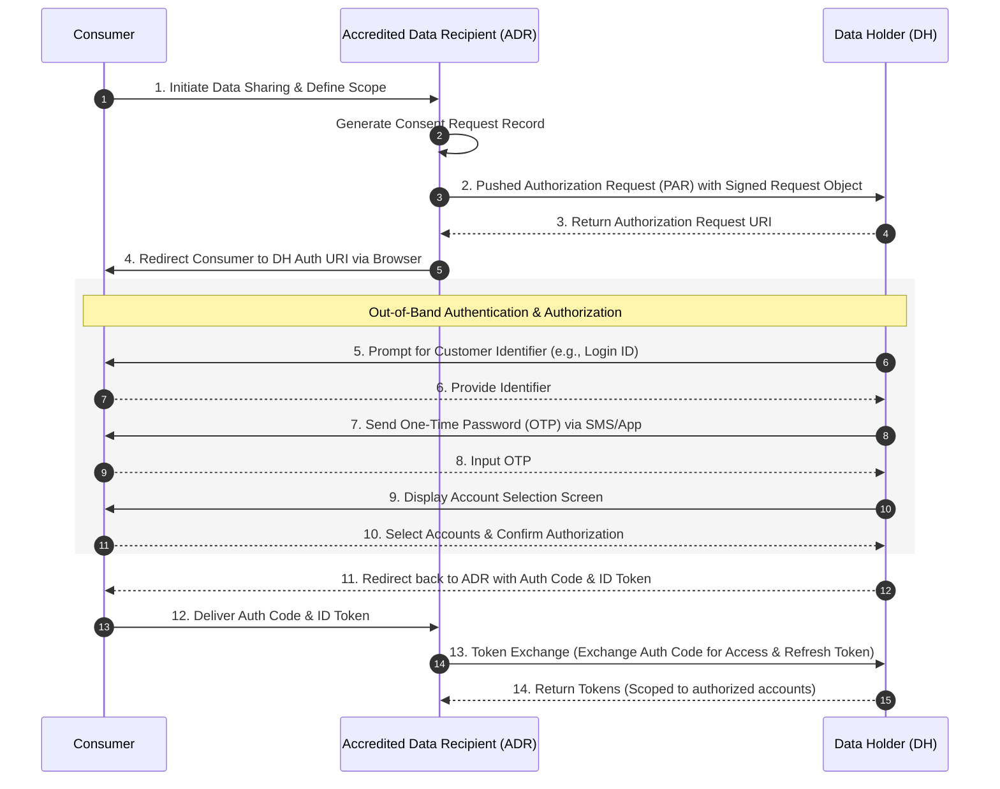
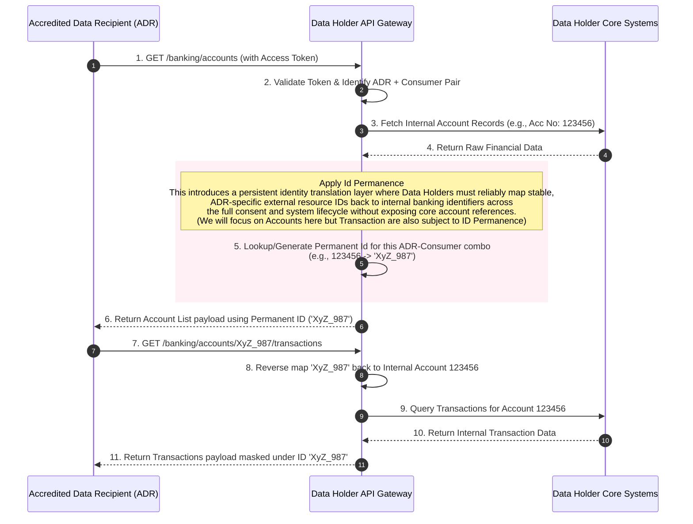
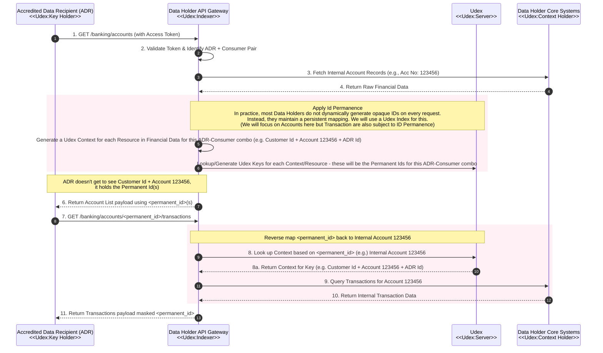

# Consumer Data Right (CDR) Open Banking with ID Permanence
> This document exists for the purpose of illustrating a use case for Udex and is not meant to be authoritative.

The Open Banking Consumer Data Right (CDR) in Australia enforces a highly structured, secure, and permission-based architecture for data sharing. This document details the technical mechanics of CDR dataflows, the implementation of **Id Permanence**, and the sequence of interactions between ecosystem participants according to the mandated [Consumer Data Standards (CDS)](https://consumerdatastandardsaustralia.github.io/standards/).

---

## 1. Architectural Components & Core Concepts

### Core Participants
*   **Consumer:** The end-user (individual or business) who owns the data and initiates the request.
*   **Accredited Data Recipient (ADR):** The fintech, lender, or service provider accredited by the **ACCC** to request and ingest data.
*   **Data Holder (DH):** The financial institution (e.g., bank, credit union) holding the consumer's original data.
*   **CDR Register:** The central authority managed by the [ACCC](https://www.accc.gov.au/) that maintains the whitelist of all accredited software products, ADRs, and DHs.

### ID Permanence (Persistent Identifiers)
To protect consumer privacy and prevent cross-Data Holder profiling, the regulatory standards mandate [**Id Permanence**](https://consumerdatastandardsaustralia.github.io/standards/#id-permanence) for resource identifiers (such as Account IDs). Regulatory implementation details can be referenced in the [Official CDS Guidance on ID Permanence](https://cdr-support.zendesk.com/hc/en-us/articles/6140375237647-Guidance-on-ID-permanence).
*   **Customer-Specific Masking:** When a Data Holder exposes an account ID via an API, that ID must be unique to the specific ADR-Consumer combination.
*   **Consistency:** The ID must remain identical for subsequent requests by the same ADR for the same consumer.
*   **Isolation:** If the same consumer shares the exact same bank account with a *different* ADR, the Data Holder must generate a completely different ID.
*   **Irreversibility:** The masked ID must be a cryptographically secure, non-reversible token so that the ADR cannot deduce the original internal bank account number.

> The implication of this is that Data Holders will need to be generate and lookup a lot of new Ids (Keys) for their customers data reliably and scalably - sounds like a mission for Udex.

---

## 2. Phase 1: Consent and Dynamic Client Registration

Before data can flow, the ADR must discover the Data Holder's endpoints via the CDR Register and ensure their software is registered with the Data Holder using OIDC protocols specified on the [Consumer Data Standards GitHub Portal](https://consumerdatastandardsaustralia.github.io/standards/).

---

## 3. Phase 2: Hybrid Flow Authentication and Authorization

The CDR uses a profile of **OIDC / OAuth 2.0 (FAPI 1.0 Advanced)**. The consumer must be securely redirected to the Data Holder to authenticate without sharing their bank credentials with the ADR, satisfying consumer workflow steps outlined by the [Official CDR Framework Guide](https://www.cdr.gov.au/how-it-works).

> The Data Holder could use Udex here if they don't want to put internal keys for the Consumer in the Tokens sent to the ADR, but we will focus on the Id Permanence scenario below.

---

## 4. Phase 3: Resource Data Retrieval with ID Permanence

Once the ADR holds a valid access token, it requests financial resources. This is where the Data Holder enforces **Id Permanence** mappings to insulate back-end databases.

> This is the generic version: the implementation of this with Udex is shown next

## 4A. Phase 3: Resource Data Retrieval with ID Permanence implemented with Udex
> The above implemented using Udex to provide the permanent Ids for the Consumer that will be held by the ADR - the keys are different for each Consumer ADR combination for the same financial data entities. The Data Holder API acts as the Udex Indexer and the Data Holder Core Systems act as the Udex Context Holder.

---
## 5. Not Shown: Revocation & Renewal Data flows, internal processes such as account migration etc.
However it should be noted that permanent ids must perist through renewal.

## 6. Security and Compliance Controls

*   **Mutual TLS (mTLS):** All network traffic between ADRs, Data Holders, and the Register requires mTLS using X.509 certificates issued by the CDR Certificate Authority.
*   **Request Object Signing:** Authorization requests must be signed JSON Web Tokens (JWTs) using keys declared in the participant's JWKS.
*   **Consent Lifecycle Management:** Consents can last a maximum of 12 months. ADRs must provide a "Consent Dashboard" allowing users to revoke access at any point, triggering an immediate token revocation cascade back to the Data Holder. Privacy rules and de-identification obligations are strictly regulated under the [OAIC Consumer Data Right Guidelines](https://www.oaic.gov.au/consumer-data-right/consumer-data-right-legislation,-regulation-and-definitions/consumer-data-right-legislation).
