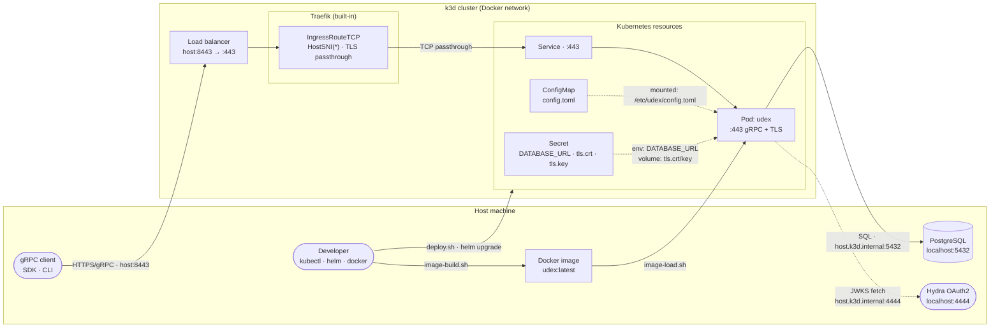

# Local Kubernetes Development

This directory contains the Helm chart and scripts for running Udex in a local [k3d](https://k3d.io) Kubernetes cluster. The same chart is used for production deployments.

## Prerequisites

- **k3d** ≥5.x — `brew install k3d` / [k3d.io](https://k3d.io/stable/#installation)
- **kubectl** ≥1.x — [kubernetes.io/docs/tasks/tools](https://kubernetes.io/docs/tasks/tools/)
- **Helm** ≥4.x — [helm.sh/docs/intro/install](https://helm.sh/docs/intro/install/)
- **Docker** — running daemon with the devcontainer or local Docker Desktop
- Workspace first-time setup complete (`gen-env.sh` + `gen-keys-and-certs.sh`; see [CONTRIBUTING.md](../../CONTRIBUTING.md))

Run `bash scripts/dev-doctor.sh` from the workspace root to verify all prerequisites are met.

## Architecture



**Call flow** (solid lines): a gRPC client connects to the k3d load balancer on `host:8443`, which forwards to Traefik. The `IngressRouteTCP` rule passes the raw TLS bytes through to the Service and then the pod — the server terminates TLS itself. The pod connects out to PostgreSQL and (on the first request per token) fetches the Hydra JWKS to validate JWTs.

**Cluster management** (solid lines, bottom): `image-build.sh` builds the Docker image locally; `image-load.sh` imports it into the k3d cluster so pods can use `imagePullPolicy: Never`. `deploy.sh` runs `helm upgrade --install`, which creates or updates all Kubernetes resources.

**Config injection** (dashed lines): the ConfigMap is mounted as a file at `/etc/udex/config.toml`; the Secret is projected as both an environment variable (`DATABASE_URL`) and a volume (`tls.crt`, `tls.key`).

## Quickstart

Five commands from zero to passing k8s integration tests:

```bash
bash projects/k8s/scripts/image-build.sh          # build the udex Docker image
bash projects/k8s/scripts/cluster-create.sh        # create the k3d cluster
bash projects/k8s/scripts/image-load.sh            # load the image into the cluster
bash projects/k8s/scripts/deploy.sh                # deploy via Helm and wait for rollout
bash scripts/validate-k8s-test.sh                  # run the k8s integration tests
```

> **Note:** The devcontainer exposes the k3d load balancer on `host.docker.internal:8443`. The test script defaults to `K8S_SERVER_URL=https://host.docker.internal:8443`, which is correct for devcontainer use.

## Scripts

All scripts are idempotent where possible and require no arguments. Run them from the workspace root or any directory — they locate the workspace via `BASH_SOURCE`.

| Script | What it does |
|---|---|
| `image-build.sh` | Builds the `udex:latest` Docker image from `projects/rust/cli/Dockerfile`. Pass `--dev` for a debug build. |
| `cluster-create.sh` | Creates a k3d cluster named `udex` with port `8443→443` forwarded. Also patches kubeconfig for devcontainer use. Skips if cluster already exists. |
| `image-load.sh` | Imports `udex:latest` into the k3d cluster so pods can pull it without a registry. |
| `deploy.sh` | Runs `helm upgrade --install`, passing `DATABASE_URL`, `tls.crt`, and `tls.key` from `.env` and the generated certs. Waits for rollout to complete. |
| `undeploy.sh` | Runs `helm uninstall udex`. |
| `cluster-delete.sh` | Deletes the k3d cluster entirely. |

## Typical development loop

```bash
# After changing server code:
bash projects/k8s/scripts/image-build.sh
bash projects/k8s/scripts/image-load.sh
bash projects/k8s/scripts/deploy.sh        # triggers a rolling update
bash scripts/validate-k8s-test.sh
```

## Deploying a config change

Edit `helm/udex/values.yaml` or pass `--set` overrides, then re-run `deploy.sh`. Helm performs a rolling update automatically. The `checksum/secret` pod annotation ensures pods are restarted when the Secret (database URL or TLS credentials) changes.

## Teardown

```bash
bash projects/k8s/scripts/undeploy.sh     # remove the Helm release
bash projects/k8s/scripts/cluster-delete.sh  # delete the k3d cluster
```

## Helm chart structure

```text
helm/udex/
├── Chart.yaml          # name, version, appVersion
├── values.yaml         # all configurable fields with defaults
└── templates/
    ├── configmap.yaml  # server config.toml rendered from values
    ├── secret.yaml     # DATABASE_URL + TLS cert/key
    ├── deployment.yaml # single-replica pod; mounts ConfigMap and Secret
    └── service.yaml    # LoadBalancer on port 443
```

## Health probes

Udex exposes the standard [gRPC Health Checking Protocol](https://github.com/grpc/grpc/blob/master/doc/health-checking.md) (`grpc.health.v1.Health`) on port 443, with three registered services:

| Service name | What it represents |
|---|---|
| `""` | Overall server — SERVING after entry and index initialisation complete |
| `"udex.entry.v1.EntryService"` | Entry handler — SERVING after index initialisation completes |
| `"udex.index.v1.IndexService"` | Index handler — SERVING after index initialisation completes |

### Why `tcpSocket` probes and not native `grpc` probes?

Kubernetes native `grpc` probe type (beta/default since k8s 1.24, GA since 1.27) makes a plain, non-TLS gRPC connection. The Udex server is TLS-only on port 443, so a native `grpc` probe would fail at the TLS handshake on any Kubernetes version.

The Helm chart therefore uses `tcpSocket` probes. The kubelet's `tcpSocket` probe only establishes a TCP connection — it does not perform a TLS handshake or speak gRPC. This is sufficient to detect a crashed or deadlocked process that has stopped accepting connections, but it does not validate the TLS certificate or the gRPC stack.

For full TLS + gRPC stack validation, an exec-based probe using `grpc-health-probe` would be needed:

```yaml
exec:
  command: [grpc-health-probe, -addr=:443, -tls, -tls-ca-cert=/etc/udex/tls/ca.crt]
```

This requires `grpc-health-probe` to be present in the container image, which the current image does not ship. When Udex gains a dedicated non-TLS health port in a future release, native `grpc` probes will work without any extra binary.

To probe the health endpoint manually (e.g. from inside the cluster), use `grpc-health-probe` with TLS flags:

```bash
grpc-health-probe -addr=<pod-ip>:443 -tls -tls-no-verify
```

## Running k8s tests locally

```bash
bash scripts/validate-k8s-test.sh
```

This mirrors the `k8s-test` CI job exactly. It runs `cargo test -p udex-sdk --test integration_tests -- k8s`. Tests are skipped automatically when `K8S_SERVER_URL` is not set, so the regular `cargo test` run is unaffected.

See [projects/rust/CONTRIBUTING.md](../rust/CONTRIBUTING.md) for the `test_sdk_k8s_*` naming convention.
